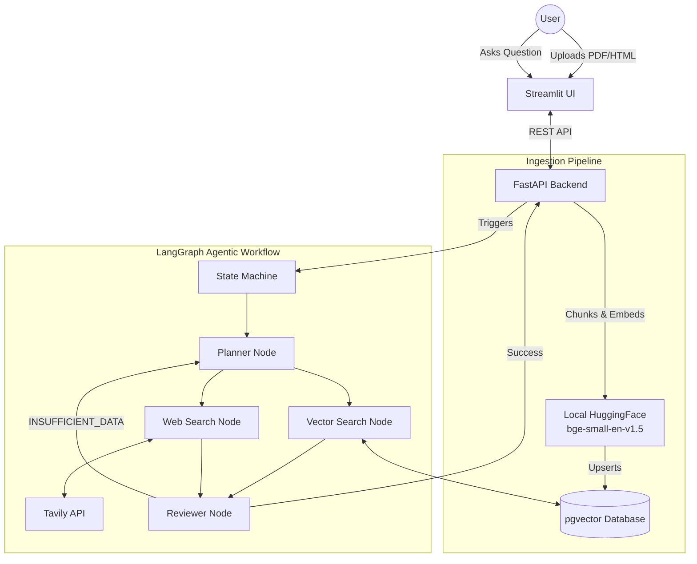

<p align="center">
  
</p>

<h1 align="center">📈 Multi-Agent Financial Researcher</h1>
<p align="center"><em>An autonomous, self-correcting multi-agent RAG system for SEC filing analysis.</em></p>

<p align="center">
  
  
  
  
  
</p>

---

## 📋 Table of Contents

- [Overview](#-overview)
- [System Architecture](#️-system-architecture)
- [Core Engineering Decisions](#-core-engineering-decisions)
- [Quickstart](#-quickstart)
- [Usage](#️-usage)
- [Tech Stack](#️-tech-stack)

---

## 🔍 Overview

A fully containerized, autonomous multi-agent research system designed to ingest SEC filings (10-Ks) and synthesize financial intelligence using a stateful LangGraph workflow.

Instead of relying on rigid, linear LLM chains, this system uses a **cyclical agentic architecture** with self-correction loops. It dynamically evaluates whether retrieved internal database context and live web news are sufficient to answer complex financial queries — automatically re-planning and retrying if data is missing.

> 💡 Record a quick GIF of the Streamlit UI uploading a file and answering a query, then swap it into the placeholder above.

---

## 🏗️ System Architecture

The entire stack is orchestrated locally with Docker Compose, pairing a Python/FastAPI backend with a PostgreSQL vector database and a Streamlit frontend.



---

## 🧠 Core Engineering Decisions

| Decision | Why It Matters |
|---|---|
| **Stateful Agentic Routing** (LangGraph) | Financial analysis often needs multi-hop reasoning. The Reviewer node validates synthesized data and can trigger a hard retry back to the Planner if critical context is missing — preventing hallucinated answers. |
| **$0-Cost Local Embeddings** (PyTorch + HuggingFace) | Runs `BAAI/bge-small-en-v1.5` locally on CPU instead of paying for OpenAI/Cohere embedding calls, eliminating ingestion costs and network latency. |
| **Relational Vector Storage** (pgvector) | Consolidates semantic search inside PostgreSQL, avoiding the operational overhead of running a separate, specialized vector database. |
| **Cross-Platform Ingestion** | Custom fallback encoding handlers (`windows-1252` → `UTF-8`) ensure legacy SEC HTML files parse flawlessly inside strict Linux containers. |

---

## 🚀 Quickstart

### 1. Prerequisites

- Docker Desktop installed and running
- API keys for **Groq** (LLM routing) and **Tavily** (live web search)

### 2. Environment Setup

Clone the repository and create your environment file:

```bash
git clone https://github.com/yourusername/fin-research-agent.git
cd fin-research-agent
cp .env.example .env
```

Add your API keys to `.env`:

```ini
GROQ_API_KEY=your_groq_key
TAVILY_API_KEY=your_tavily_key
GROQ_MODEL=openai/gpt-oss-20b
DATABASE_URL=postgresql+psycopg://admin:adminpassword@db:5432/fin_research
```

### 3. Run the Stack

Build and launch the API, database, and UI containers:

```bash
docker compose up --build
```

---

## 🖥️ Usage

1. Open your browser to **http://localhost:8501**
2. **Ingest data** — upload an SEC 10-K (PDF or HTML). The FastAPI backend chunks the document, generates local embeddings, and stores them in PostgreSQL.
3. **Run analysis** — ask a complex question, e.g.:

   > "What are the company's main operational risks mentioned in the filing, and is there any recent web news about their supply chain?"

   Watch the terminal to see the LangGraph nodes execute in real time.

---

## 🛠️ Tech Stack

Python · LangGraph · FastAPI · Streamlit · PostgreSQL (pgvector) · Docker · Groq · Tavily · HuggingFace / PyTorch

---

<p align="center"><sub>Built with Python, LangGraph, FastAPI, Streamlit, and Docker.</sub></p>
